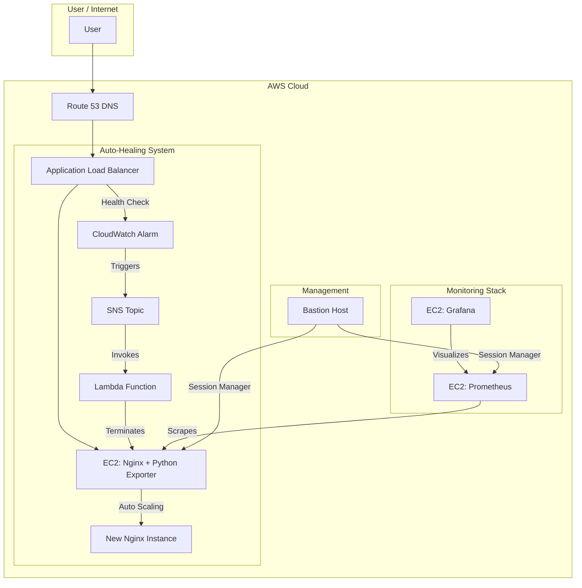

# AWS Nginx Auto-Healing System with Monitoring

This project uses Terraform to automatically deploy a **self-healing Nginx web server** on AWS with **integrated monitoring**. The system automatically detects Nginx failures and restarts the service, ensuring high availability. It also includes a complete monitoring stack with Prometheus and Grafana running on dedicated EC2 instances.

## 🏗️ Architecture



## 🚀 How it Works

### **1. Auto-Healing Flow:**
- **Health Monitoring**: Application Load Balancer continuously checks Nginx health
- **Failure Detection**: When Nginx becomes unhealthy, CloudWatch Alarm triggers
- **Auto-Recovery**: Lambda function terminates the failed instance
- **Auto-Scaling**: New Nginx instance automatically starts to replace the failed one

### **2. Monitoring Flow:**
- **Metrics Collection**: Python exporter on Nginx exposes metrics on port 8000
- **Data Storage**: Prometheus scrapes and stores metrics from Nginx
- **Visualization**: Grafana provides dashboards and alerts
- **Dynamic Discovery**: Prometheus automatically updates when Nginx IP changes

### **3. Security:**
- **Session Manager**: Secure access to EC2 instances without SSH keys
- **Security Groups**: Proper network isolation between components
- **IAM Roles**: Least privilege access for all services

## 🛠️ Tech Stack

- **Cloud**: AWS (EC2, VPC, ALB, S3, Route53, Lambda, SNS, CloudWatch, SSM)
- **IaC**: Terraform
- **Monitoring**: Prometheus, Grafana, Python Prometheus Client
- **Scripting**: Python (Lambda, Exporter), Bash (user_data)
- **Security**: AWS Session Manager, IAM, Security Groups

---

## 📋 Prerequisites

- [x] AWS Account & CLI configured
- [x] Terraform installed (v1.0+)
- [x] Domain name in Route 53 with ACM SSL Certificate
- [x] Your public IP address (for security group access)

---

## 🚀 Quickstart Guide

### **Step 1: Configure Variables**
Create `terraform.tfvars` with your configuration:

```hcl
region              = "ap-southeast-1"
environment         = "production"
project            = "nginx-monitoring"
domain_name        = "your.domain.com"
hosted_zone_id     = "YOUR_ROUTE53_HOSTED_ZONE_ID"
acm_certificate_arn = "arn:aws:acm:region:account:certificate/cert-id"
alert_email        = "your-email@example.com"
bastion_ssh_cidr   = "YOUR_PUBLIC_IP/32"  
```

### **Step 2: Deploy Infrastructure**
```bash
terraform init
terraform plan
terraform apply --auto-approve
```

### **Step 3: Access Your Services**

After deployment, you'll get these outputs:
- **Application URL**: `https://your.domain.com`
- **Prometheus**: `http://<prometheus_public_ip>:9090`
- **Grafana**: `http://<prometheus_public_ip>:3000` (admin/admin)
- **Bastion Host**: Use Session Manager to access EC2 instances

### **Step 4: Test Auto-Healing**

1. **Access Nginx**: Visit your domain URL
2. **Simulate Failure**: Use Session Manager to connect to Nginx EC2 and run:
   ```bash
   sudo systemctl stop nginx
   ```
3. **Observe Recovery**: 
   - Check CloudWatch Alarm status
   - Monitor Lambda function logs
   - Verify new Nginx instance starts
   - Confirm website becomes accessible again

### **Step 5: Monitor Your System**

1. **Prometheus Targets**: Check `http://<prometheus_ip>:9090/targets`
2. **Grafana Dashboard**: 
   - Login with admin/admin
   - Add Prometheus data source: `http://prometheus:9090`
   - Import or create dashboards for Nginx metrics

---

## 📁 Project Structure

```
├── main.tf                 # Main Terraform configuration
├── variables.tf            # Variable definitions
├── outputs.tf              # Output values
├── terraform.tfvars        # Your configuration values
├── nginx_userdata.sh       # Nginx instance setup script
├── nginx_monitor.py        # Python exporter for Nginx metrics
├── lambda_function_updated.py  # Auto-healing Lambda function
├── prometheus.yml          # Local Prometheus config (for reference)
└── README.md               # This file
```

---

## 🔧 Key Features

### **✅ Auto-Healing**
- Automatic detection of Nginx failures
- Lambda-driven recovery mechanism
- Zero-downtime service restoration

### **✅ Monitoring**
- Real-time metrics collection
- Prometheus + Grafana stack
- Dynamic target discovery

### **✅ Security**
- Session Manager access (no SSH keys)
- Proper security group isolation
- IAM roles with least privilege

### **✅ Scalability**
- Auto Scaling Group ready
- Multi-AZ deployment
- Load balancer health checks

---

## 🧪 Testing

### **Test Auto-Healing:**
```bash
# Connect to Nginx via Session Manager
# Stop Nginx service
sudo systemctl stop nginx

# Wait 2-3 minutes for auto-healing
# Check website accessibility
curl https://your.domain.com
```

### **Test Monitoring:**
```bash
# Check Prometheus targets
curl http://<prometheus_ip>:9090/targets

# Check Nginx metrics
curl http://<nginx_private_ip>:8000/metrics
```

---

## 🧹 Cleanup

To avoid AWS charges, destroy the infrastructure:
```bash
terraform destroy --auto-approve
```

---

## 📞 Support

For issues or questions:
1. Check CloudWatch logs for Lambda function
2. Verify security group configurations
3. Test network connectivity between components
4. Review Terraform plan output for configuration issues

---

## 🎯 Next Steps

- [ ] Add more comprehensive Grafana dashboards
- [ ] Implement alerting rules in Prometheus
- [ ] Add more monitoring targets (database, cache, etc.)
- [ ] Implement blue-green deployment strategy
- [ ] Add cost optimization recommendations 